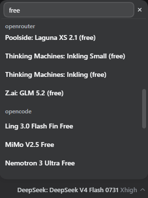
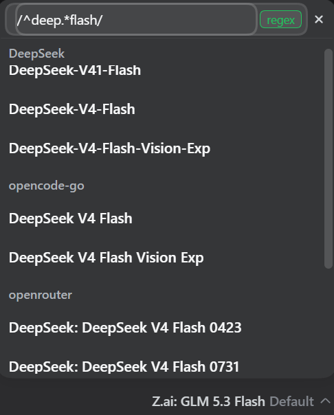

# dsh-plugin-model-filter

A DSH plugin that adds a **search / filter box** to the model selection menu in
the DSH chat composer. With many providers and models in your catalog, the
default menu is a long grouped list; this plugin lets you type to filter it
instantly (`Search models…`) without touching the rest of the selection UX.



> **Compatibility:** version 0.3.2 is verified against DSH `0.1.7-rc.2`
> and retains the DSH `0.1.5-rc.2` icon and selection-result contracts. See
> [DSH 0.1.7-rc.2 compatibility](docs/dsh-0.1.7-rc2.md) for the diagnosis and
> isolated validation procedure.

## Search syntax

The filter box supports two modes: plain text and regular expressions.

### Plain text

A case-insensitive substring match, exactly as before (e.g. `deepseek v4`).
Text that merely contains slashes (e.g. a model id like
`deepseek-official/deepseek-v4`) still searches as plain text.

### Regex

Wrap a pattern in slashes to switch to a regular expression: `/pattern/`,
optionally followed by flags: `/pattern/i`. The pattern applies to the model
name, model id, provider name, and provider id; an invalid pattern
(e.g. `/[/`) shows a short "Invalid pattern" hint instead of silently
matching nothing.

As soon as the input starts with a `/`, a small **`regex` badge** appears at
the right end of the field: gray while the pattern is incomplete, **green**
once it is a valid regular expression, red when it fails to compile.



Flags `i`, `m`, `s`, `u` are honored; `g`/`y` are ignored to keep the
matcher stateless.

**Examples** (with a typical catalog):

| Filter | Matches |
| --- | --- |
| `/^gpt/i` | models whose name starts with "gpt", any case (`GPT-4o`, `GPT-4o mini`, `GPT-4 Turbo`) |
| `/pro\|flash/` | models containing "pro" **or** "flash" (`deepseek-v4-pro`, `deepseek-v4-flash`) |
| `/(v4\|turbo)/` | "v4" or "turbo" anywhere (`deepseek-v4-pro`, `deepseek-v4-flash`, `GPT-4 Turbo`) |
| `/mini$/` | models ending with "mini" (`GPT-4o mini`) |
| `/\d+$/` | models ending with a digit (`deepseek-r1`) |
| `/\d\.\d/` | version numbers like "x.y" (`Claude 3.5 Sonnet` for 3.5) |
| `/^claude/i` | the whole Anthropic provider group (pattern also tests provider name/id) |
| `/\bro\b/` | "ro" as a whole word (matches little — "pro" has no word boundary before "ro") |

> Regex basics: `^`/`$` anchor start/end, `|` means "or", `\d`/`\w` are
> character classes, `\.` escapes a literal dot, `\b` is a word boundary,
> `(...)` groups alternatives. A literal `/` inside a pattern must be
> escaped as `\/`.

It is the properly-named, distributable successor to the earlier profile-local
name-shadowing fork (`@deepseek-ai/dsh-client-ui-model-selection` vendored copy).
Instead of shadowing the shipped package name, this plugin is a real
third-party bundle named `dsh-plugin-model-filter` that:

1. **coexists** with the shipped `ui-model-selection` row (it is *not*
   disabled), and
2. inserts its own client row which occupies the public
   `conversation.input.model` slot with the search-enabled picker.

Because the stock row is kept active, the shipped package remains the single
source of truth for the `modelDirectories` service (consumed by
`@nanmicoder/dsh-agent-teams`), the `/model` popup command, and the `model`
locale namespace. Disabling or removing this plugin is therefore **safe**: the
stock picker takes the seat back and boot never loses the service provider.

## How it works

The web profile composes its browser module graph from loader rows. A plugin
package that declares `dsh.bundle.patch` in its `package.json` becomes a
*profile layer* when installed through `dsh plugin`:

```jsonc
// package.json
{
  "name": "dsh-plugin-model-filter",
  "dsh": {
    "bundle": { "patch": "./cordis.patch.yml" },
    "client": { "platform": "web", "inject": [ /* provider packages */ ] }
  }
}
```

`cordis.patch.yml` is applied as a patch over the composed web profile, in
`dsh.profile.bundles` order (after `dsh-web-app`), and only performs one edit:

```yaml
- insert:                    # our own client row at the root
    - id: ui-model-filter
      name: 'dsh-plugin-model-filter'
```

The node half of `dsh-client-modules` scans the inserted row, resolves the
package by name, serves `exports["./client"]` (`lib/client.js`), and the
browser registers the search-enabled `ModelSelect` on the slot.

### Slot ownership

`conversation.input.model` is a `kind: "single"`, session-scope slot. The stock
`ui-model-selection` row and this bundle's row both register the seat, but the
native slot registry renders the entry with the **lowest priority** (its own
error text: *"register at a different priority to shadow it (lowest
renders)"*). The stock row registers at the default priority `0`; this bundle
registers at `priority: -1`, so the searchable picker renders while the stock
row stays live. When this bundle is disabled or removed, the stock picker (no
search) takes over automatically.

### Rendered vs. owned responsibilities

| Concern | Owner |
| --- | --- |
| `modelDirectories` service (`directoryFor`) | stock `ui-model-selection` |
| `/model` popup command | stock `ui-model-selection` |
| `model` locale namespace dictionaries | stock `ui-model-selection` |
| `conversation.input.model` seat rendering (with search) | this bundle |
| search-only dictionary keys (`menu.filterPlaceholder`, `menu.clear`, `empty.noMatch`) | this bundle, in-render fallback (the stock dictionaries do not define them) |

## Requirements

- DSH with the web profile (`@deepseek-ai/dsh-web-app` bundle).
- Verified on DSH `0.1.7-rc.2`; the compatibility adapter also supports the
  `0.1.5-rc.2` browser primitive names and model-selection result contract.
- pnpm available on `PATH` (used by `dsh plugin`).
- React / `@deepseek-ai/cordis` peer dependency (provided by the web bundle).
- Node.js and npm only when running the repository compatibility tests.

## Install

From a local checkout (no registry needed):

```sh
dsh plugin --profile web add link:/path/to/dsh-plugin-model-filter
```

From a git URL:

```sh
dsh plugin --profile web add git+https://github.com/EiffelBS/dsh-plugin-model-filter.git
```

`dsh plugin` runs `pnpm add` in the profile directory, then reconciles
`dsh.profile.bundles`: because this package declares `dsh.bundle.patch`, it is
auto-appended as a profile layer. Restart the target web instance after an
install, update, disable, or re-enable, then open a fresh browser session. A
page refresh alone is not a substitute for restarting bundle composition.

Verify installation:

```sh
dsh web --profile web --no-open   # then check the model menu includes the search box
```

## Compatibility tests

The tracked gate uses the exact DSH `0.1.7-rc.2` client contracts while also
retaining the older browser API surface:

```sh
# Example with npm; pnpm works as well.
npm install --no-package-lock
npm test
```

The repository does not commit a package-manager lockfile; the exact DSH
`0.1.7-rc.2` versions are pinned in `devDependencies`. The test verifies that
the patch is exactly one inserted row, stock-shaped and plugin slot
registrations coexist at priorities `0` and `-1`, disposal/remount removes only
the plugin entry, both modern and legacy primitive-shaped module surfaces
render, search preserves provider/model identity, and both legacy `void` and
rc2 `RemoteResult` selection outcomes are handled. The target package
declarations are dev-only pins; they are not runtime dependencies of the
published plugin.

## Update

Stop the target web instance before updating it. Package-manager reconciliation
may replace parts of `node_modules`, and a live server can hold native packages
open on Windows.

After pulling a newer revision of this repository (or a published release):

```sh
dsh plugin --profile web update dsh-plugin-model-filter
```

then start the web instance again and use a fresh browser session.

## Uninstall / disable

```sh
dsh plugin --profile web remove dsh-plugin-model-filter
```

Reconciliation removes the bundle from `dsh.profile.bundles`; the stock
`ui-model-selection` row was never disabled, so the model picker and the
`modelDirectories` service are restored untouched on the next start.

> Because the stock row is never disabled by this plugin, a profile-level
> *disable* of the bundle row is also safe: `modelDirectories` stays provided
> by the stock row, so consumers of that service keep their native provider.
> Only do not disable the *stock* `ui-model-selection` row in addition to
> removing this plugin; that combination would leave the service without a
> provider.

## Layout

```
package.json          name dsh-plugin-model-filter, dsh.bundle.patch, dsh.client
cordis.patch.yml      inserts the client row (stock row left active)
lib/index.js          host half (empty apply - pure UI plugin)
lib/client.js         browser half: search filter, ModelSelect on the slot
test/compatibility.test.mjs  DSH rc2 contract and behavior gate
docs/dsh-0.1.7-rc2.md      compatibility diagnosis and validation record
```

## Under the hood

- The picker occupies the public slot `conversation.input.model`
  (`kind: "single"`, session scope). This bundle registers it at
  `priority: -1` while the stock row stays at `0`, and the registry renders the
  lowest-priority entry — so the searchable picker wins the single-slot
  election while the stock package keeps providing the service, command, and
  dictionary keys.
- Removing this bundle cannot starve `modelDirectories`: the provider is the
  stock row, not this bundle. A DSH `0.1.5`-era audit of the first-generation
  design observed `@nanmicoder/dsh-agent-teams` waiting for that service when
  the stock provider had been disabled. This is historical motivation for the
  ownership split, not a claim about every DSH `0.1.7` consumer.
- DSH `0.1.5` completed a successful model selection with `void`; DSH
  `0.1.7-rc.2` returns `RemoteResult<void>`. The injected face normalizes both
  contracts so a resolved `{ ok: false }` is surfaced as a failure rather than
  mistaken for success.

## Limitations

- Requires the stock `ui-model-selection` row to stay enabled (its default
  state). This plugin deliberately does not provide the `modelDirectories`
  service, so it cannot replace the stock row entirely.
- Search is client-side over the loaded catalog; the catalog itself still comes
  from the Host generation snapshot.

## License

MIT